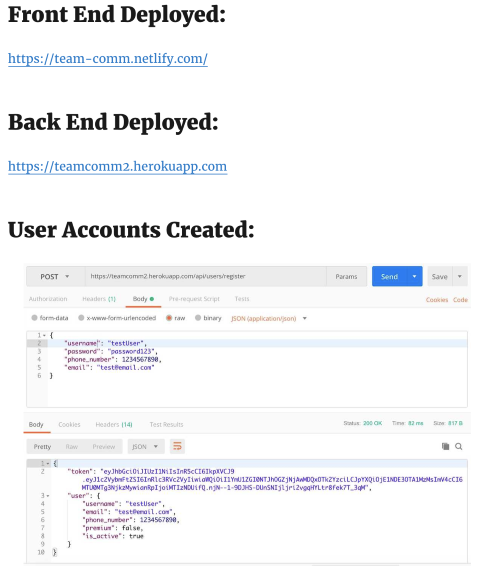

One of the toughest parts about learning web development is the moment when you change from solo work to group projects. Some of you have spent the last six months dreading pair programming, but doing it when you are required to. Some of you may have learned to like it immediately. This is just the beginning though…what happens when you add a third, fourth or fifth developer in the mix? It's okay to have mixed feelings about working with others. You might have thoughts like:

_What if we don't get along?_

_What if they think my code is messy?_

_What if they think I'm not good enough?_

These thoughts only get worse with less communication in group. So what did we do to combat this part? We spent two full days planning on Zoom Calls and Slack. We hashed out as many details as we could. Instead of assigning tasks, we asked the right questions.

According to our project managers, more communication usually results in a better project outcomes. So we took this to the highest level we could. We would attempt to maintain contact on zoom through most of our coding sessions, with options to break away if needed at any time. What are you most interested in? Do you prefer back-end or front-end? We figured out our strong areas and our weak areas as a group. Even more important, we learned about each other. We talked, laughed and enjoyed tearing into the project details together. If we each did this alone, and then came back together…we wouldn't nearly be as close within only a few days of work. We haven't really ran into any friction yet (that I've noticed), but I'm sure we will get to that point eventually.

##Contributions this week

<a href="https://github.com/Lambda-School-Labs/Labs8-TeamComms/graphs/contributors"> JJAshcraft's Contributions</a>

####Documentation Update

https://github.com/Lambda-School-Labs/Labs8-TeamComms/pull/3

https://trello.com/c/Hqowrv8u

###Netlify Deployment

https://github.com/Lambda-School-Labs/Labs8-TeamComms/pull/10

https://trello.com/c/jDGsXLXN

_See blog post for detailed analysis:_
https://hackernoon.com/netlify-continuous-deployment-github-react-lambdaschool-67f3ae658d31

###Build Login Component

https://github.com/Lambda-School-Labs/Labs8-TeamComms/pull/16

https://trello.com/c/072Aios2

###Landing-Page-Signup

https://github.com/Lambda-School-Labs/Labs8-TeamComms/pull/8

https://trello.com/c/ZkznYz0S

#Team Contributions

##Database Reference

##Backend Reference

##Frontend Reference

