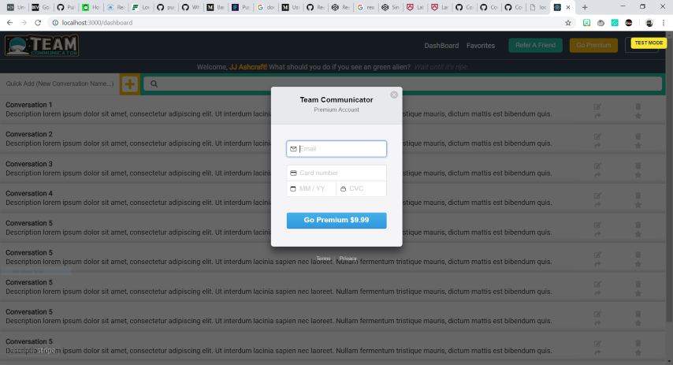

##Part 1 - Individual Accomplishments this Week

https://www.youtube.com/watch?v=2dTNWHNWlWY

Whiteboard coding challenge number 1, Queue with Two Stacks

This week was short, but super intense. We had a holiday on Monday (although a few of our team members put in a couple hours anyway), so we had more work to do than time. This week we were tasked with implementing the base API's we would need for a working app, as well as adding OAuth login to our app. Based on the instruction, we thought we only needed two api's to complete the sprint...but on wednesday we found out that we actually needed all 3 working. So our backend was returning user data, and we had stripe integration, but we did not have a working version of real-time document collaboration via websockets yet. We dove into the docs for socket.io, and came up with a very rudimentary socket implementation at first. Could we get a button to change color on all connected clients, just to show the working sockets?! You bet. It took several hours attempting to figure out how to get our app to listen on multiple ports, but we got it to work. It took another 30 minutes to figure out how to make a working textarea that is updateable by all clients. We were a bit late on delivery, but we did deliver.

We also made huge strides in the look and feel of our web app. By wednesday, we had a functioning dashboard that displays the logged in user and their current conversations. We also managed to get the MongoDB database connected to OAuth, so that a user who logs in with google gets an account created in our app as well.

##Contributions this week

<a href="https://github.com/Lambda-School-Labs/Labs8-TeamComms/graphs/contributors"> JJAshcraft's Contributions</a>

###Tasks Pulled

####Detailed Analysis
for: https://github.com/Lambda-School-Labs/Labs8-TeamComms/pull/29

For this pull request, I layed out all of the dashboard components and gave them advanced styling (including a CSS Grid implementation).
The CSS Grid was somewhat difficult to figure out, with multiple routes and different components being laid out in the grid depending on what screen you are on. I also updated the header buttons with react-router links, and added a new component tentatively called easter egg. This is more of a fun component that adds space puns to the dashboard of our app. Although the implementation only took about 10 minutes, it has been well received. I also added the quick add component

Date:
11/13/2018
Name:
Josh Ashcraft
Link to PR(s) completed last working day:
https://github.com/Lambda-School-Labs/Labs8-TeamComms/pull/16

Link to Trello card(s) completed last working day
https://trello.com/c/072Aios2

Link to Trello card(s) being worked on...current day
https://trello.com/c/Lp0ruYgh
https://trello.com/c/jvrJ3wqY

---

Date:
11/14/2018
Name:
Josh Ashcraft
Link to PR(s) completed last working day:
https://github.com/Lambda-School-Labs/Labs8-TeamComms/pull/25
https://github.com/Lambda-School-Labs/Labs8-TeamComms/pull/21

Link to Trello card(s) completed last working day
https://trello.com/c/21pJT4a3
https://trello.com/c/jvrJ3wqY

Link to Trello card(s) being worked on...current day
https://trello.com/c/ABkJLrRg
https://trello.com/c/JhZ5IM1f

---

Date:
11/15/2018
Name:
Josh Ashcraft
Link to PR(s) completed last working day:
https://github.com/Lambda-School-Labs/Labs8-TeamComms/pull/29
https://github.com/Lambda-School-Labs/Labs8-TeamComms/pull/31
https://github.com/Lambda-School-Labs/Labs8-TeamComms/pull/35

Link to Trello card(s) completed last working day
https://trello.com/c/ABkJLrRg
https://trello.com/c/JhZ5IM1f

Link to Trello card(s) being worked on...current day
https://trello.com/c/WPGQg8AE

---

Date:
11/16/2018
Name:
Josh Ashcraft
Link to PR(s) completed last working day:
https://github.com/Lambda-School-Labs/Labs8-TeamComms/pull/45

Link to Trello card(s) completed last working day
https://trello.com/c/EDn1hxkN

Link to Trello card(s) being worked on...current day
https://trello.com/c/vhpBseQ7

###Team Contributions

Working with a team can be tough at times, as we figure out who takes on more of a leadership role as well as how to divide up tasks. The part I feel like we are struggling with a little, is how to make sure everyone is getting their share of work done on both the back-end and the front-end...as some of the pieces to our app require working in both simultaneously, from one machine. It's also difficult to put together an app without fully fleshed mockups for team members to build components from. As of right now, I am trying to develop a style guide to make it easier, but ultimately we will need to modify most of the app to make the css match. This could have been circumvented if we had more time to flesh out a real mockup, or had a designer on our team whose job was to do just that. This is a real catch 22 with the current Lambda Labs, as it is giving freedom to choose what the app looks like, but that might be a problem for a group who can't agree on that part. Luckily, we haven't had that problem yet...we have gotten lucky that everyone seemed to enjoy the styles I started with.

####Front and back end servers are connected

####Users can create accounts and log in through the front end via OAuth

####All APIs and services are connected and can be interacted with through the front end.

 
 

